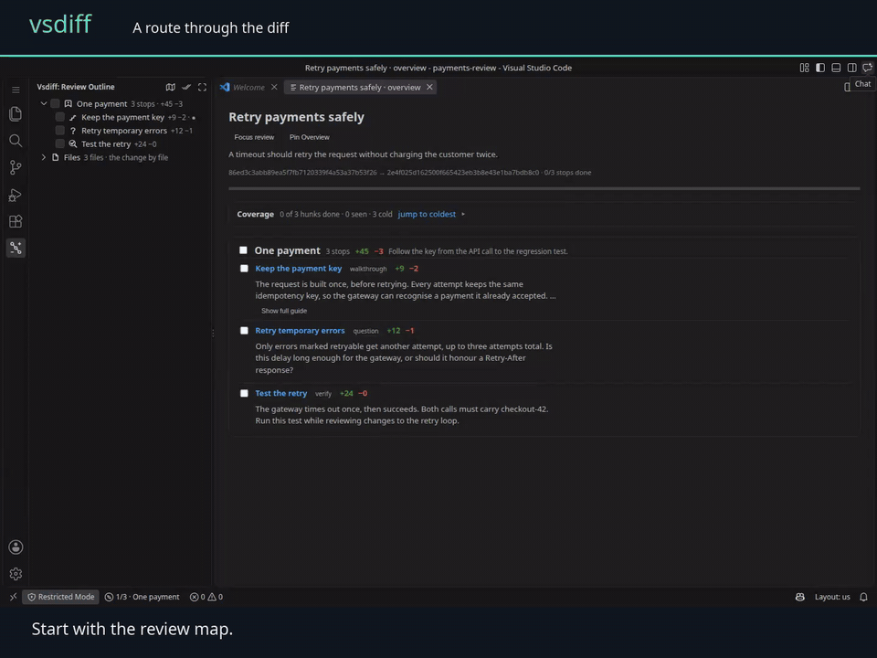
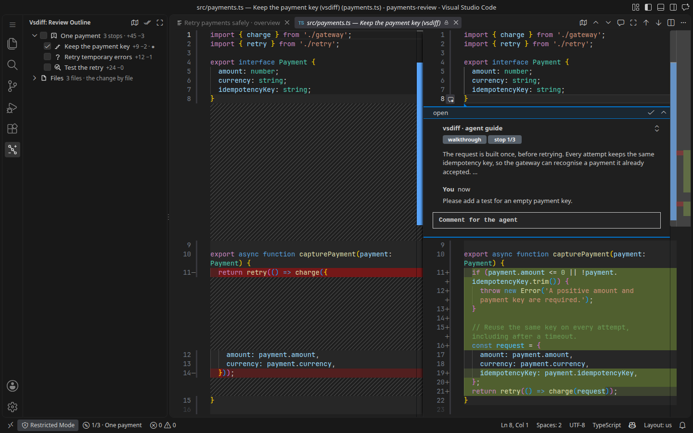

# vsdiff

**Let your coding agent explain the change. Review it where the code lives.**

vsdiff turns a Git diff into a guided review in VS Code or a local browser tab.
Your agent writes the route: what changed, why it matters, and which lines need
attention. You walk the stops, ask questions beside the code, and send your
feedback back to the agent.

[](https://github.com/albertusdev/vsdiff/actions/workflows/ci.yml)
[](LICENSE)



[Watch the full demo](https://github.com/albertusdev/vsdiff/releases/latest/download/vsdiff-demo.mp4)
· [Install](#install)
· [Try a review](#try-a-review)
· [How it works](#how-it-works)

## A review you can follow

- **Start with the map.** Chapters explain the change; stops link to real diff
  hunks. Uncovered files stay visible so the guide cannot hide the rest of the diff.
- **Keep room for code.** Overview is a normal tab. Pin it beside the diff when
  you want both, or use Focus Review to hide the extra panels.
- **Ask at the right line.** Reply under the agent's guide or add a line comment.
  Long explanations expand when you need them. Draft replies survive layout changes.
- **Give the agent something it can act on.** Comments, replies, and your final
  decision are saved locally as structured data. The agent can wait for your
  review, read the feedback, fix the code, and reply in the same thread.



vsdiff supplies the review interface and file format. It does not call a model,
require an AI subscription, or send your code to a vsdiff service. Use any coding
agent that can edit a JSON file and run a command.

## Install

This early release is distributed as source and a VSIX. There is no Marketplace,
OpenVSX, or npm installation yet.

You need **Node.js 22 or later**, **pnpm 9.15.9**, **Git**, and **VS Code 1.104 or
later** with the `code` command on your PATH. GitHub review commands also need
[GitHub CLI](https://cli.github.com/) signed in to your account.

```bash
git clone https://github.com/albertusdev/vsdiff.git
cd vsdiff
pnpm install --frozen-lockfile
pnpm build
node scripts/install-cli.mjs
code --install-extension dist/vsdiff.vsix --force
```

The CLI installer writes `~/.local/bin/vsdiff` and points it at this checkout.
Keep the checkout, and make sure `~/.local/bin` is on your PATH. Restart an
already-open editor window after updating the extension.

If you only need the editor extension, download `vsdiff.vsix` from
[Releases](https://github.com/albertusdev/vsdiff/releases) and install it with
`code --install-extension vsdiff.vsix`. The source install supplies the companion
CLI that creates sessions and reads feedback.

The install scripts and browser launcher currently target **Linux and macOS**.
This release was exercised on Linux; native Windows installation is not yet
supported by those scripts. VS Code forks can be selected in the configuration,
but their compatibility has not been verified for this release.

## Try a review

From the built checkout:

```bash
pnpm demo
```

This creates a separate sample repository under `.dev/demo/` with a payment-retry
change and an authored review. Your project files are untouched. Walk the three
stops, leave a reply, and choose **Finish Review**.

Prefer a browser? Use VS Code's local web server:

```bash
VSDIFF_EDITOR=web pnpm demo
```

The first launch may download VS Code's server. It binds to loopback and requires
a private connection token. The CLI opens an authenticated URL; keep that URL
private. Workspace Trust still applies to agent-authored HTML guides.

## Give your agent the review loop

Tell your coding agent:

> Use `vsdiff guide` to learn the format. Create a guided review of your change,
> explain the important decisions, include the remaining files, validate the
> session, then open it and wait for my feedback.

```bash
# The agent scaffolds the session and writes its chapters and stops.
vsdiff new --title "Retry payments safely"
vsdiff guide
vsdiff validate

# You review; the agent waits for your decision.
vsdiff open --await

# The agent reads the comments and responds.
vsdiff feedback --json
vsdiff reply --thread <id> --body "Fixed the retry limit."
```

A canceled or timed-out review is not approval. `--await` returns a structured
result so the agent can distinguish approval, requested changes, and cancellation.

Claude Code can install the [bundled skill](skills/claude/vsdiff/SKILL.md) with
`vsdiff init --skill claude`. Agents that use MCP can run `vsdiff mcp` over stdio.
Neither integration grants permission to publish a GitHub review on your behalf.

## How it works

```text
Agent writes session.json → You review native diffs → feedback.jsonl + result.json
                                      ↑                         │
                                      └── Agent fixes and replies
```

A session references your Git repository; it does not copy the diff into JSON.
Stops name hunks such as `src/payments.ts:h1`. vsdiff computes the diff and shows
where the references still resolve. Keep ordinary Git review judgment: a guide is
an explanation, not proof that a change is correct.

| Review mode        | What you do                                                                                   |
| ------------------ | --------------------------------------------------------------------------------------------- |
| Local change       | Review the working tree, staged files, a commit, or a branch range.                           |
| GitHub PR          | Bring a PR into a local review and explicitly publish a review through your own `gh` account. |
| Proposed PR review | Let an agent draft comments, then accept, edit, or drop each one before publishing.           |

Coverage estimates which hunks have been displayed. Automatic checkmarks use
visible editor ranges sampled while you review; they do not prove comprehension. Choose `vsdiff.review.autoDone: "off"`
for manual checkmarks.

**Keyboard:** `Ctrl+Alt+J` / `Ctrl+Alt+K` walks the review. Submit a comment with
`Ctrl+Enter` on Linux or the visible comment button. Overview, comment, and Focus
Review actions are available in the editor toolbar and command palette.

## Configuration

User settings live in `~/.config/vsdiff/config.jsonc` (or `$XDG_CONFIG_HOME/vsdiff/`).
Run `vsdiff config` to see the paths, merged values, and selected editor.

```jsonc
{
  "editor": "web",
  "web": { "port": 3123 },
}
```

A repository's `.vsdiff/config.jsonc` can select an editor preset and review
preferences. Custom executable commands and browser server settings are accepted
only from the user configuration. Run `vsdiff web status` or `vsdiff web stop`
to manage your local browser server.

Upgrading from the private 0.1.x browser build? Stop its old server before opening
a review with this release. Unauthenticated servers are no longer reused.

## Contribute

Bug reports with a small reproduction are welcome. Start with
[CONTRIBUTING.md](CONTRIBUTING.md) for the build, tests, demo recording, and package
layout. The [architecture notes](docs/architecture.md) describe the data flow.

For security reports, use the private process in [SECURITY.md](SECURITY.md).

## License

[MIT](LICENSE). The VS Code server is downloaded separately and remains subject
to Microsoft's license terms.
